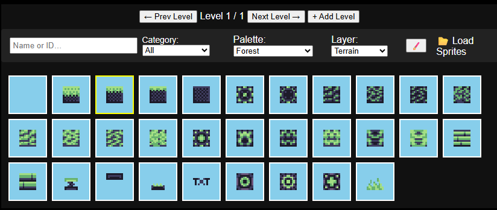
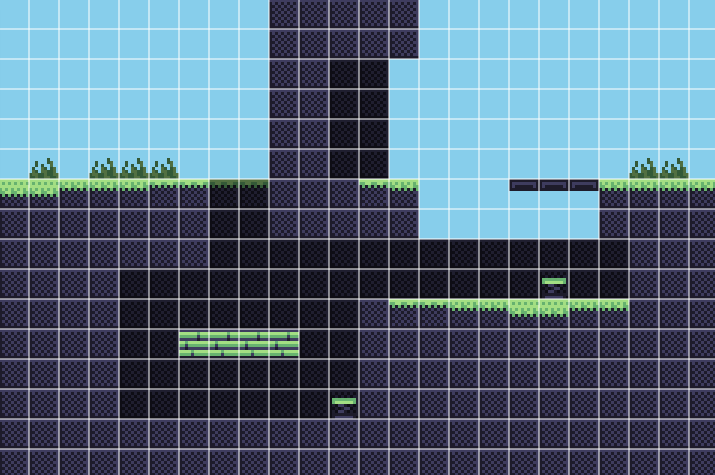
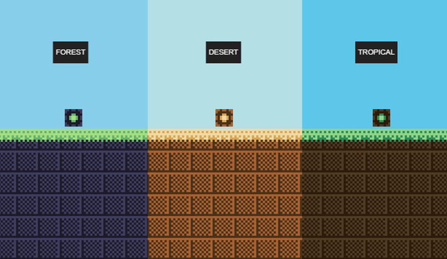
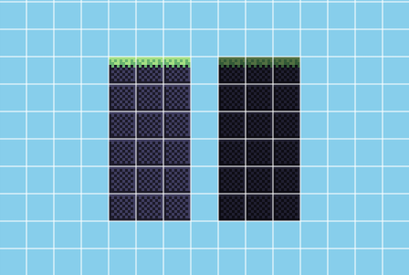
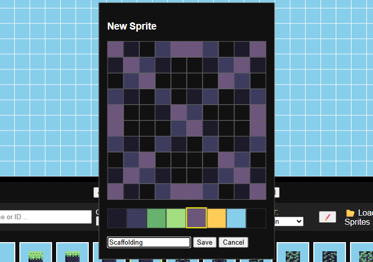
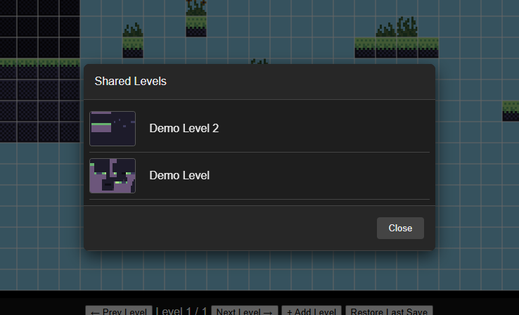

# Systematic  

https://lolo23450.github.io/systematic/  

https://github.com/Lolo23450/systematic/blob/main/README.md#modding-guide

A web-based **pixel platformer level editor** and playtester—fully in your browser. Create, edit, sprite, and play your own 2D platformer levels without writing a single line of engine code!

---

## Features

- **Tile Palette & Tile Categories**  
  - 30+ tiles organized into categories  
  - Live‐expandable via UI  
  

- **Grid-based Editing**  
  - Paint terrain, background, objects, spikes, bounce pads, platforms, text tiles, and more  
  - Click-and-drag painting; right-click for per-tile properties  
  

- **Multi-level Support**  
  - Create, navigate, rename, and delete levels  
  - All levels can be exported/imported as JSON  

- **Custom Color Palettes**  
  - 10+ built-in palettes (Forest, Desert, Tundra, Swamp, …)  
  - Live preview & swatch picker in sprite editor  
  

- **Layered Editing**  
  - Background & terrain layers (plus extensible object layer)  
  - Control visibility, paint order, and per-tile schemas  
  

- **Playtest Mode**  
  - Switch between **Edit** & **Play** instantly  
  - Built-in physics: gravity, jump, one-way platforms, bounce pads, spikes  

- **Sprite Editor**  
  - Draw new 10×10 pixel sprites, assign palette indices, name them  
  - Import & merge external sprite JSON  
  

- **Custom Tile Properties**  
  - Bounce pads: adjustable jump strength  
  - One-way platforms: toggle “allow drop” (press S)  
  - Extendable schema for new tile types  

- **Open-source & Attribution**  
  - Licensed under MIT—free to use, modify, share with credit  

---

## Level Persistence & Sharing

### Auto-Save in Browser  
- Edits (painting, adding/removing levels, property changes) are saved automatically to `localStorage`.  
- On page load, your last session is restored—no extra clicks needed.

### Export/Import JSON  
- **Save All Levels** downloads a `levels.json` file containing every level.  
- **Load All Levels** lets you pick a `.json` file to import—levels overwrite your current work and become your new auto-save.

### Shareable & Bookmarkable URLs  
- Your entire level set is compressed (via LZ-String) and encoded into the URL hash.  
- As you edit, the URL updates in real-time—copy/paste to share your exact levels!  
- Opening someone’s link decodes the hash and loads their levels instantly, no file download required.

### Online Levels
- You can publish levels and share them using an unique name.
- Once your level is published, you can share that name and other players with that name will be able to load it using the Load Shared Level Button.
- Or you can find it in the level browser.
  

## Installation

1. Clone or download this repo  
2. Open `index.html` in any modern browser (no build step required)  

---

## Controls

### Editor Mode  
- **Left-click & drag**: paint current tile  
- **Right-click**: open tile properties sidebar  
- **Mouse wheel**: zoom in/out  
- **Arrow keys / WASD**: pan camera
- **Ctrl+Z / Ctrl+Y**: Undo / Redo

### Toolbar  
- **Tile Search**: filter brushes by name or ID  
- **Category**: switch brush groups  
- **Palette**: change colors  
- **Layer**: select edit layer  
- **🖌️**: open sprite editor  
- **📂**: import external sprites  

### Level Controls  
- **← Prev / Next →**: switch levels  
- **+ Add Level**: create a blank level  
- **Save All Levels**: download JSON & auto-save in browser  
- **Load All Levels**: import JSON from disk  
- **Restore Last Save**: reload from browser storage  
- **Upload Level**: uploads your level
- **Load Shared Level**: loads a level
### Playtest Mode  
- **W / ↑**: jump  
- **A / ←**, **D / →**: move  
- **S / ↓**: drop through one-ways  

---

## Modding Guide

### Overview

This game provides an API and a system of hooks that allow you to extend and customize gameplay behavior. Mods can respond to in-game events, modify player state, or add new mechanics without changing the core game code.

### Hooks

Hooks are functions that the game engine calls at specific points during gameplay. You can register your own functions to these hooks via the `SystematicAPI.on` method.

Common hooks include:

* **`onUpdate(player, keys)`**
  Called every frame during the game update. Provides access to the current player object and the state of input keys.

* **`onPreInput(player, keys)`**
  Fires before you even process movement input each frame. Perfect for mods that want to override or inject custom controls.

* **`onPostInput(player, keys)`**
  Fires after you player.vx & player.vy from input, but before physics. Great for mods that tweak velocities.
  
* **`onPostPhysicsCollision(player, keys)`**
  Fires after the physics and collision are handled, but before special tile collisions, and before setting the final player position. Great for correcting or tweaking the player's        final position before any custom tile physics / collisions

* **`onPostSpecialPhysicsCollision(player, keys)`**
  Fires after the collision and special tile collision are handled, but before setting the final player position. Great for correcting or tweaking the player's final final position 
  after custom tile physics / collisions
  
* **`onPlayerJump(player)`**
  Called when the player performs a jump, returns player attributes like x, y, vx, vy, height, width, etc
  
* **`onPlayerTouchGround(player)`**
  Called when the player lands on the ground, returns player attributes like x, y, vx, vy, height, width, etc

* **`onPlayerTouchCeiling(player)`**
  Called when the player touches the ceiling, returns player attributes like x, y, vx, vy, height, width, etc

* **`onPlayerTouchWallRight(player, tileX, tileY, layer)`**
  Called when the player touches a wall on the right, returns player attributes like x, y, vx, vy, height, width, etc, and where that event happened (tx,ty,layer).

* **`onPlayerTouchWallLeft(player, tileX, tileY, layer)`**
  Called when the player touches a wall on the left, returns player attributes like x, y, vx, vy, height, width, etc, and where that event happened (tx,ty,layer).

* **`onPlayerBounce(player, tileX, tileY, layer)`**
  Called when the player bounces on a spring, returns player attributes like x, y, vx, vy, height, width, etc, and where that event happened (tx,ty,layer).

* **`prePlayerTouchWallRight(player, tileX, tileY, layer)`**  
  Called right before the engine snaps the player to the right wall and zeros horizontal velocity. If any listener returns `true`, the default zeroing of `player.vx` is skipped, 
  letting mods override behavior like wall climbing or jumping.

* **`prePlayerTouchWallLeft(player, tileX, tileY, layer)`**  
  Called right before the engine snaps the player to the left wall and zeros horizontal velocity. Returning `true` from any listener prevents the engine from resetting `player.vx`, 
  enabling custom wall-touch behavior.

* **`prePlayerTouchCeiling(player, tileX, tileY, layer)`**  
  Called right before the engine snaps the player under the ceiling and zeros vertical velocity. Returning `false` from any listener prevents zeroing `player.vy` and position snapping, 
  allowing continuous upward movement (like wall climbing).

* **`onKeyDown(key)`**
  Called when a key is pressed, returns the key pressed.

* **`onMouseDown(x, y, button)`**  
  *Called when the user presses a mouse button. `x`, `y` are the coordinates relative to the canvas; `button` is the button index (0 = left, 1 = middle, 2 = right).*

* **`onMouseUp(x, y, button)`**  
  *Called when the user releases a mouse button. Same arguments as `onMouseDown`.*


### Player Object

The player object includes properties such as:

* `x`, `y`: Position coordinates.
* `vx`, `vy`: Velocity components.
* `width`, `height`: Size dimensions.
* `onGround`: Boolean indicating whether the player is on the ground.
* Custom properties can be added as needed for your mod.

### Example: Adding Double Jump

Below is a simplified example of adding double jump functionality using hooks:

```js
const DOUBLE_JUMP_DELAY = 250;
const jumpPower = -10

// Reset jump count & record time on first jump
SystematicAPI.on("onPlayerJump", (player) => {
  player._jumpCount      = 1;                    // used one jump
  player._lastJumpTime   = performance.now();    // record when it happened
});

// Reset on landing
SystematicAPI.on("onPlayerTouchGround", (player) => {
  player._jumpCount      = 0;
  player._lastJumpTime   = 0;
  player._doubleJumpKeyDown = false;
});

// Watch every frame for the double‐jump key, but enforce delay
SystematicAPI.on("onUpdate", (player, keys) => {
  const now = performance.now();
  const canDoubleJump =
    !player.onGround &&                               // in air
    (player._jumpCount || 0) === 1 &&                 // used exactly one jump
    (now - (player._lastJumpTime || 0)) >= DOUBLE_JUMP_DELAY;

  if ((keys["w"] || keys["ArrowUp"])  &&               // jump key
      canDoubleJump &&                                 // delay passed
      !player._doubleJumpKeyDown) {                    // debounce
    // PERFORM DOUBLE JUMP:
    player.vy               = jumpPower;
    player._jumpCount      += 1;
    player._lastJumpTime    = now;                     // update time
    player._doubleJumpKeyDown = true;

    // Optional double‐jump hook & effects
    SystematicAPI.trigger("onPlayerDoubleJump", player);
  }

  // Reset debounce when key is released
  if (!(keys["w"] || keys["ArrowUp"])) {
    player._doubleJumpKeyDown = false;
  }
});
```

### Triggering Custom Events

You can also trigger your own events using:

```js
SystematicAPI.trigger('eventName', ...args);
```

For example, trigger a custom event when the player performs a double jump:

```js
SystematicAPI.trigger('onPlayerDoubleJump', player);
```

---

### Register Functions

The core API provides three register methods:

```js
SystematicAPI.registerTile({...});
SystematicAPI.registerColorPalette(name, colors);
SystematicAPI.registerModal(name, config);
````

---

### Register Tile

Use `registerTile` to define new tiles for the editor. The configuration object must include:

* `id` (number|string): unique tile ID
* `name` (string): display name in the editor
* `category` (string): category name to group this tile (creates it if missing)
* `sprite` (2D array of palette indices): the tile’s pixel data
* `properties` (object): any custom data your mod needs

```js
// 1. define the sprite data
const heavySpringSprite = [
  [7,7,7,7,7,7,7,7,7,7],
  [7,7,7,7,7,7,7,7,7,7],
  [7,7,7,7,7,7,7,7,7,7],
  [7,2,2,2,2,2,2,2,2,7],
  [7,2,3,3,3,3,3,3,2,7],
  [7,7,7,1,1,0,7,7,7,7],
  [7,7,7,7,0,1,1,7,7,7],
  [7,7,7,1,1,0,7,7,7,7],
  [7,0,0,0,0,0,0,0,0,7],
  [7,0,1,1,1,1,1,1,0,7],
];

// 2. register it
SystematicAPI.registerTile({
  id: 99,
  name: "Heavy Spring",
  category: "Example Mod",
  sprite: heavySpringSprite,
  properties: { bounce: 20 }
});
```

---

### Register Color Palette

Use `registerColorPalette` to add named color schemes:

```js
SystematicAPI.registerColorPalette("Mossy Grove", [
  "#3b4a2f", // deep moss shadow
  "#66794b", // moss base
  "#8ca16c", // fresh highlight
  "#b6c396", // sunlit patches
  "#a48a6d", // damp soil
  "#d6c9b1", // fallen leaves
  "#c2d8b0", // misty sky
  "rgba(0,0,0,0)" // transparent
]);
```

---

### Register Modal

Use `registerModal` to define custom dialogs. The `config` object accepts:

* `title` (string)
* `content` (string | Node | function returning a Node)
* `buttons` (array of `{ label, onClick, className? }`)

```js
SystematicAPI.registerModal("confirmReset", {
  title: "Reset Level?",
  content: "Are you sure you want to restart?",
  buttons: [
    { label: "Cancel", onClick: () => {} },
    { label: "Reset", onClick: () => resetLevel() }
  ]
});

// Then show it:
SystematicAPI.showModal("confirmReset");
```

---

Ahh! Thanks for the correction, Lolo 🐾✨ Here's the updated **README section** that properly documents the **particle emitter system** (not the raw particle spawner):

---

### Register Particle Emitters

Use `SystematicAPI.registerParticleEmitter` to define reusable named particle emitters (like **dust clouds**, **sparkles**, **explosions**, etc).

```js
SystematicAPI.registerParticleEmitter("dustPoof", {
  max:      20,                // max particles per emission
  lifetime: [0.3, 0.6],        // seconds (min and max)
  velocity: {
    x: [-30, 30],              // horizontal px/sec
    y: [-60, 0]                // vertical px/sec
  },
  gravity:  200,               // px/sec² (pulls particles down)
  color:    ["#888", "#aaa"],  // colors (random pick)
  size:     [1, 3]             // particle radius in px
});
```

This registers a particle style called `"dustPoof"` that you can trigger from anywhere in the game.

---

### Emit Particles

To emit a burst of particles at a location, use:

```js
SystematicAPI.emitParticles("dustPoof", x, y);
```

Example: emit when the player lands

```js
SystematicAPI.on("onPlayerTouchGround", (player) => {
  const px = player.x + player.width / 2;
  const py = player.y + player.height;
  SystematicAPI.emitParticles("dustPoof", px, py);
});
```

This creates a satisfying dust effect under the player on landing! 🌫️

---

### Emitter Config Options

| Key        | Type                               | Description                                 |
| ---------- | ---------------------------------- | ------------------------------------------- |
| `max`      | `number`                           | Max particles per emission burst            |
| `lifetime` | `[min, max]`                       | How long each particle lasts (in seconds)   |
| `velocity` | `{ x: [min, max], y: [min, max] }` | Initial particle speed ranges               |
| `gravity`  | `number`                           | Constant downward acceleration (px/sec²)    |
| `color`    | `string` or `string[]`             | Fill color(s) – can be a single hex or list |
| `size`     | `[min, max]`                       | Radius of each particle (in pixels)         |

---

### Example: Spark Emitter

```js
SystematicAPI.registerParticleEmitter("spark", {
  max: 12,
  lifetime: [0.1, 0.3],
  velocity: { x: [-100, 100], y: [-100, 100] },
  gravity: 0,
  color: ["#ff0", "#f80", "#fc0"],
  size: [1, 2]
});
```

---

### Built-in Utility Functions

#### `animateTileOnce(layer, x, y, frames, fps)`

Animate a tile sequence at `(x,y,layer)`.

```js
animateTileOnce(1, tx, ty, [25,24,23,26,26,23], 32);
```

#### `drawSprite(data, x, y)`

Render a sprite’s 2D array `data` at pixel position `(x,y)` on the game canvas:

```js
function drawSprite(data, x, y) {
  const spriteDim     = data.length;
  const pixelSize     = Math.floor(tileSize / spriteDim) || 1;
  const spritePixelSz = spriteDim * pixelSize;
  const offset        = Math.floor((tileSize - spritePixelSz) / 2);

  for (let row = 0; row < spriteDim; row++) {
    for (let col = 0; col < spriteDim; col++) {
      const ci = data[row][col];
      if (ci < 0) continue;
      ctx.fillStyle = palette[ci] || "#000";
      ctx.fillRect(
        x + offset + col * pixelSize,
        y + offset + row * pixelSize,
        pixelSize,
        pixelSize
      );
    }
  }
}
```

Use this inside custom UI canvases or mods to draw any registered sprite.

---


## License & Attribution

Licensed under the **MIT License**.  
© 2025 lolo2345 — Attribution required.  
See [LICENSE](LICENSE) for full text.
