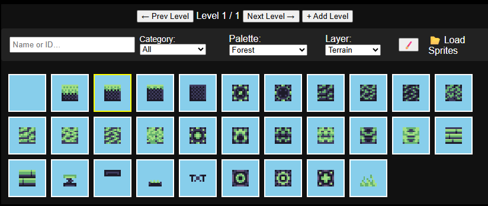
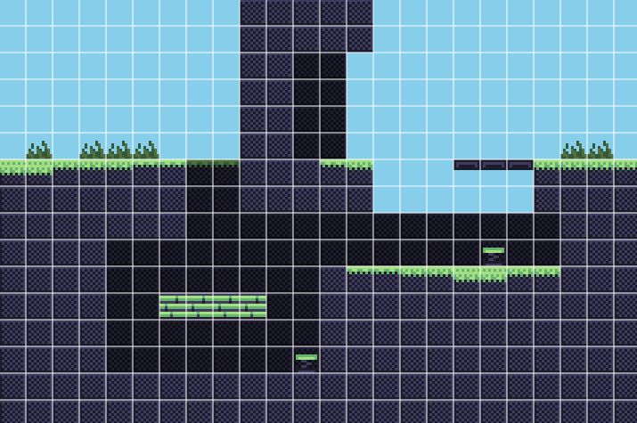
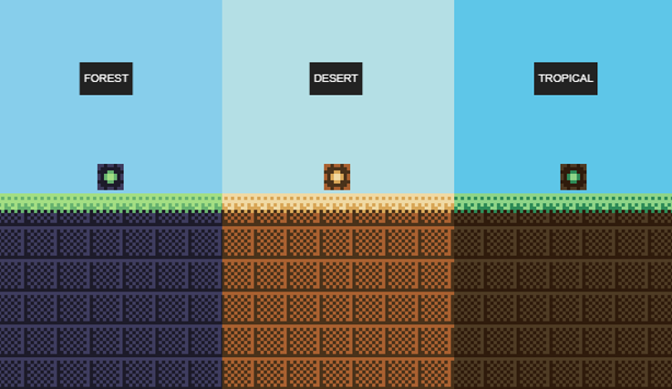
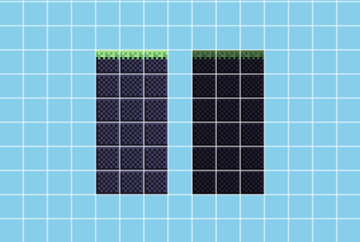
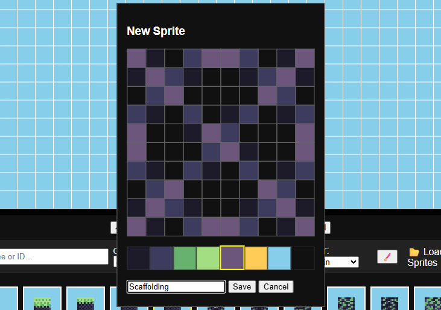

# Systematic  

https://lolo23450.github.io/systematic/  

https://github.com/Lolo23450/systematic/blob/main/README.md#modding-guide

A web-based **pixel platformer level editor** and playtester—fully in your browser. Create, edit, sprite, and play your own 2D platformer levels without writing a single line of engine code!

---

## Features

- **Tile Palette & Tile Categories**  
  - 30+ tiles organized into categories  
  - Live‐expandable via UI  
  

- **Grid-based Editing**  
  - Paint terrain, background, objects, spikes, bounce pads, platforms, text tiles, and more  
  - Click-and-drag painting; right-click for per-tile properties  
  

- **Multi-level Support**  
  - Create, navigate, rename, and delete levels  
  - All levels can be exported/imported as JSON  

- **Custom Color Palettes**  
  - 10+ built-in palettes (Forest, Desert, Tundra, Swamp, …)  
  - Live preview & swatch picker in sprite editor  
  

- **Layered Editing**  
  - Background & terrain layers (plus extensible object layer)  
  - Control visibility, paint order, and per-tile schemas  
  

- **Playtest Mode**  
  - Switch between **Edit** & **Play** instantly  
  - Built-in physics: gravity, jump, one-way platforms, bounce pads, spikes  

- **Sprite Editor**  
  - Draw new 10×10 pixel sprites, assign palette indices, name them  
  - Import & merge external sprite JSON  
  

- **Custom Tile Properties**  
  - Bounce pads: adjustable jump strength  
  - One-way platforms: toggle “allow drop” (press S)  
  - Extendable schema for new tile types  

- **Particle System**  
  - Register named particle emitters  
  - Emit particles with custom color, gravity, velocity, and size  
  - Built-in helpers for dust, sparks, and more

- **Advanced Modding API**  
  - Register/unregister event hooks with unsubscribe support  
  - Register custom tiles, palettes, modals, and tile property schemas  
  - Utility helpers for tile/level/player manipulation  
  - Particle system and modal helpers  
  - Full event system with error handling and debugging

- **Open-source & Attribution**  
  - Licensed under MIT—free to use, modify, share with credit  

---

## Level Persistence & Sharing

### Auto-Save in Browser  
- Edits (painting, adding/removing levels, property changes) are saved automatically to `localStorage`.  
- On page load, your last session is restored—no extra clicks needed.

### Export/Import JSON  
- **Save All Levels** downloads a `levels.json` file containing every level.  
- **Load All Levels** lets you pick a `.json` file to import—levels overwrite your current work and become your new auto-save.

### Shareable & Bookmarkable URLs  
- Your entire level set is compressed (via LZ-String) and encoded into the URL hash.  
- As you edit, the URL updates in real-time—copy/paste to share your exact levels!  
- Opening someone’s link decodes the hash and loads their levels instantly, no file download required.

## Installation

1. Clone or download this repo  
2. Open `index.html` in any modern browser (no build step required)  

---

## Controls

### Editor Mode  
- **Left-click & drag**: paint current tile  
- **Right-click**: open tile properties sidebar  
- **Mouse wheel**: zoom in/out  
- **Arrow keys / WASD**: pan camera
- **Ctrl+Z / Ctrl+Y**: Undo / Redo

### Toolbar  
- **Tile Search**: filter brushes by name or ID  
- **Category**: switch brush groups  
- **Palette**: change colors  
- **Layer**: select edit layer  
- **🖌️**: open sprite editor  
- **📂**: import external sprites  

### Level Controls  
- **← Prev / Next →**: switch levels  
- **+ Add Level**: create a blank level  
- **Save All Levels**: download JSON & auto-save in browser  
- **Load All Levels**: import JSON from disk  
### Playtest Mode  
- **W / ↑**: jump  
- **A / ←**, **D / →**: move  
- **S / ↓**: drop through one-ways  

---

## Trigger Zone System

Trigger zones let you define rectangular areas on the map that fire actions when the player walks into them. They are created and managed in **Zone Edit** mode and persist alongside your levels.

### How to Use

1. Open the controls panel (top-right) and click **Zone Edit**
2. **Click and drag** on the canvas to draw a new zone
3. A property panel appears on the right — set the **Action**, optional **Label**, and any action-specific parameters
4. Click **Apply** to confirm, or **Delete** to remove the zone
5. **Right-click** an existing zone to reopen its property panel
6. **Drag** a zone body to move it; drag its **corner/edge handles** to resize
7. Press **Delete** while a zone is selected to remove it
8. Click **Playtest** to test zones live — switch back to edit mode to reset them

### Zone Actions

| Action | Color | Description |
|---|---|---|
| **None** | Gray | Visual marker only — no gameplay effect |
| **Next Level** | Green | Advances to the next level when the player enters |
| **Teleport** | Blue | Teleports the player to the center of another zone by ID |
| **Spawnpoint** | Yellow | Sets the player's respawn position; also used as the initial spawn when playtesting starts |
| **Checkpoint** | Orange | Sets the respawn position and optionally displays a message |
| **Kill Player** | Red | Instantly respawns the player at the last spawnpoint or checkpoint |
| **Show Message** | Purple | Displays a custom text message on screen for a configurable duration (ms) |

### Zone-related Events

Listen to these via `SystematicAPI.on(eventName, fn)`:

| Event | Arguments | When it fires |
|---|---|---|
| `onZoneEnter` | `player, zone` | Player enters any zone |
| `onZoneExit` | `player, zone` | Player exits any zone |
| `onSpawnPointSet` | `spawnPoint, zone` | A **Spawnpoint** zone is activated |
| `onCheckpoint` | `spawnPoint, zone` | A **Checkpoint** zone is activated |
| `onPlayerKilled` | `player, zone` | A **Kill Player** zone triggers |
| `onZoneMessage` | `message, zone` | A **Show Message** zone triggers |
| `onPlayerRespawn` | `player` | The player respawns after being killed |
| `onLevelChange` | `levelIndex` | A **Next Level** zone advances the level |

### Zone Object Structure

Each zone passed to event listeners has these properties:

```js
{
  id: 3,                    // unique zone ID (auto-assigned)
  level: 0,                 // which level this zone belongs to
  tx: 5, ty: 2,             // top-left position in tile coordinates
  tw: 4, th: 3,             // width and height in tiles
  action: "checkpoint",     // zone action type (see table above)
  label: "Mid Boss",        // optional display label
  actionParams: {           // action-specific data
    message: "Checkpoint!"  // e.g. for checkpoint / showMessage
  }
}
```

### Example: Listening to Zone Events

```js
// Flash the screen red when the player enters a kill zone
SystematicAPI.on("onPlayerKilled", (player, zone) => {
  console.log(`Player killed by zone #${zone.id} — respawning`);
});

// Log every zone the player enters
SystematicAPI.on("onZoneEnter", (player, zone) => {
  console.log(`Entered zone "${zone.label || zone.action}" #${zone.id}`);
});

// React specifically to checkpoints
SystematicAPI.on("onCheckpoint", (spawnPoint, zone) => {
  console.log(`Checkpoint saved at tile (${spawnPoint.x}, ${spawnPoint.y})`);
});
```

---

## Modding Guide

### Overview

This game provides an API and a system of hooks that allow you to extend and customize gameplay behavior. Mods can respond to in-game events, modify player state, or add new mechanics without changing the core game code.

### Hooks

Hooks are functions that the game engine calls at specific points during gameplay. You can register your own functions to these hooks via the `SystematicAPI.on` method.

Common hooks include:

* **`onUpdate(player, keys)`**
  Called every frame during the game update. Provides access to the current player object and the state of input keys.

* **`onPreInput(player, keys)`**
  Fires before you even process movement input each frame. Perfect for mods that want to override or inject custom controls.

* **`onPostInput(player, keys)`**
  Fires after player.vx & player.vy are set from input, but before physics. Great for mods that tweak velocities.
  
* **`onPostPhysicsCollision(player, keys)`**
  Fires after the physics and collision are handled, but before special tile collisions, and before setting the final player position. Great for correcting or tweaking the player's final position before any custom tile physics / collisions

* **`onPostSpecialPhysicsCollision(player, keys)`**
  Fires after the collision and special tile collision are handled, but before setting the final player position. Great for correcting or tweaking the player's final final position 
  after custom tile physics / collisions
  
* **`onPlayerJump(player)`**
  Called when the player performs a jump, returns player attributes like x, y, vx, vy, height, width, etc
  
* **`onPlayerTouchGround(player)`**
  Called when the player stands on the ground, returns player attributes like x, y, vx, vy, height, width, etc

* **`onPlayerTouchCeiling(player)`**
  Called when the player touches the ceiling, returns player attributes like x, y, vx, vy, height, width, etc

* **`onPlayerTouchWallRight(player, tileX, tileY)`**
  Called when the player touches a wall on the right, returns player attributes like x, y, vx, vy, height, width, etc, and where that event happened (tx,ty).

* **`onPlayerTouchWallLeft(player, tileX, tileY)`**
  Called when the player touches a wall on the left, returns player attributes like x, y, vx, vy, height, width, etc, and where that event happened (tx,ty).

* **`onPlayerBounce(player, tileX, tileY)`**
  Called when the player bounces on a spring, returns player attributes like x, y, vx, vy, height, width, etc, and where that event happened (tx,ty).

* **`prePlayerTouchWallRight(player, tileX, tileY)`**  
  Called right before the engine snaps the player to the right wall and zeros horizontal velocity. If any listener returns `true`, the default zeroing of `player.vx` is skipped, 
  letting mods override behavior like wall climbing or jumping.

* **`prePlayerTouchWallLeft(player, tileX, tileY, layer)`**  
  Called right before the engine snaps the player to the left wall and zeros horizontal velocity. Returning `true` from any listener prevents the engine from resetting `player.vx`, 
  enabling custom wall-touch behavior.

* **`prePlayerTouchCeiling(player, tileX, tileY, layer)`**  
  Called right before the engine snaps the player under the ceiling and zeros vertical velocity. Returning `false` from any listener prevents zeroing `player.vy` and position snapping, 
  allowing continuous upward movement (like wall climbing).

* **`onKeyDown(key)`**
  Called when a key is pressed, returns the key pressed.

* **`onMouseDown(x, y, button)`**  
  *Called when the user presses a mouse button. `x`, `y` are the coordinates relative to the canvas; `button` is the button index (0 = left, 1 = middle, 2 = right).*

* **`onMouseUp(x, y, button)`**  
  *Called when the user releases a mouse button. Same arguments as `onMouseDown`.*

* **`onKeyUp(key)`**  
  Called when a key is released. Returns the key string (same format as `onKeyDown`).

* **`onTilePlaced(x, y, layer, tileId)`**  
  Fired in **edit mode** whenever a tile is painted onto the map. `x` and `y` are the **pixel** coordinates of the tile's top-left corner (i.e. `tileCol * tileSize` and `tileRow * tileSize`). `layer` is the layer index (0 = background, 1 = terrain). `tileId` is the ID of the tile that was just placed. Fires even when painting over an existing tile with the same ID is skipped — only fires when the tile actually changes.

* **`onTileRemoved(x, y, layer, tileId)`**  
  Fired in **edit mode** whenever a non-empty tile is overwritten or erased. Same coordinate and argument format as `onTilePlaced`. `tileId` is the ID of the tile that was just removed. Only fires when the tile being replaced was not already empty (ID 0).

---

### API Helper Functions

The API now includes a wide range of helper functions for modding and scripting:

#### Tile & Level Utilities
- **`SystematicAPI.getCurrentMode()`**  
  Returns "play"/"edit" as strings depending on the mode

- **`SystematicAPI.getTileAt(x, y, layer)`**  
  Get the tile ID at a given position and layer.

- **`SystematicAPI.getTilePosition(tileID, layer = 1)`** 
  Get the position of a tile by giving the tile id and layer

- **`SystematicAPI.getCameraPosition()`** 
  Returns the camera position (x, y)

- **`SystematicAPI.getLevelArrayData()`**
  Returns the current level data as an array

- **`SystematicAPI.setLevelArrayData(arr)`** 
  Loads an array of level data

- **`SystematicAPI.saveTileAreaTemplate(x, y, w, h, name)`**
  Saves a rect selection area of the level into the localstorage, define an unique name for it

- **`SystematicAPI.api.loadTileAreaTemplate(x, y, name)`**
  Loads a saved template from localstorage into a specified position of the level, use the unique name to load it

- **`SystematicAPI.setTileAt(x, y, layer, id)`**  
  Set the tile ID at a given position and layer.

- **`SystematicAPI.fillRect(x, y, w, h, layer, id)`**  
  Fill a rectangle of tiles with a given ID.

- **`SystematicAPI.findTiles(id, layer)`**  
  Find all tiles with a given ID on a layer.

- **`SystematicAPI.getPlayerPosition()`**  
  Get the current player position.

- **`SystematicAPI.setPlayerPosition(x, y)`**  
  Set the player position.

- **`SystematicAPI.getCurrentLevelIndex()`**  
  Get the current level index.

- **`SystematicAPI.setCurrentLevel(index)`**  
  Switch to a different level by index.

- **`SystematicAPI.getTileProperties(x, y, layer)`**  
  Get custom properties for a tile.

- **`SystematicAPI.setTileProperties(x, y, layer, props)`**  
  Set custom properties for a tile.

- **`SystematicAPI.forEachTile(callback)`**  
  Iterate over every tile in the current level.

- **`SystematicAPI.reloadLevel()`**  
  Reload the current level from storage.

- **`SystematicAPI.exportLevelAsJSON()`**  
  Export the current level as JSON.

- **`SystematicAPI.importLevelFromJSON(json)`**  
  Import a level from JSON.

#### Tile Property Schemas

- **`SystematicAPI.registerTilePropertySchema(tileID, schemaArray)`**  
  Register a property schema for a tile.

- **`SystematicAPI.extendTilePropertySchema(tileID, extraFields)`**  
  Extend a tile's property schema.

- **`SystematicAPI.getTilePropertySchema(tileID)`**  
  Get a tile's property schema.

- **`SystematicAPI.removeTilePropertySchema(tileID)`**  
  Remove a tile's property schema.

#### Particle System

- **`SystematicAPI.registerParticleEmitter(name, config)`**  
  Register a named particle emitter.

- **`SystematicAPI.emitParticles(name, x, y)`**  
  Emit a burst of particles at a location.

#### Modal System

- **`SystematicAPI.registerModal(name, config)`**  
  Register a custom modal dialog.

- **`SystematicAPI.showModal(name)`**  
  Show a registered modal.

- **`SystematicAPI.hideModal(name)`**  
  Hide a modal.

#### Event System

- **`SystematicAPI.on(eventName, fn)`**  
  Register an event listener. Returns an unsubscribe function.

- **`SystematicAPI.off(eventName, fn)`**  
  Remove an event listener.

- **`SystematicAPI.trigger(eventName, ...args)`**  
  Trigger an event.

- **`SystematicAPI.triggerCancelable(eventName, ...args)`**  
  Trigger an event, cancelable if any listener returns `false`.

---

### Example: React to Tile Placement & Removal

`onTilePlaced` and `onTileRemoved` fire whenever the editor paints a tile. Use them to trigger effects, update game state, or log changes.

```js
// Emit sparks whenever a tile is placed in edit mode
SystematicAPI.registerParticleEmitter("placeSpark", {
  max: 6,
  lifetime: [0.1, 0.25],
  velocity: { x: [-40, 40], y: [-60, -10] },
  gravity: 120,
  color: ["#fff", "#adf", "#8cf"],
  size: [1, 2]
});

SystematicAPI.on("onTilePlaced", (x, y, layer, tileId) => {
  // x, y are pixel coords — pass them straight to the emitter
  SystematicAPI.emitParticles("placeSpark", x, y);
  console.log(`Placed tile ${tileId} on layer ${layer} at pixel (${x}, ${y})`);
});

SystematicAPI.on("onTileRemoved", (x, y, layer, tileId) => {
  console.log(`Removed tile ${tileId} from layer ${layer} at pixel (${x}, ${y})`);
});
```

> **Tip:** To convert pixel coordinates back to tile grid coordinates, divide by `tileSize`:  
> `const tileCol = x / tileSize;`  
> `const tileRow = y / tileSize;`

---

### Example: Adding Double Jump

Below is a simplified example of adding double jump functionality using hooks:

```js
const DOUBLE_JUMP_DELAY = 250;
const jumpPower = -10

// Reset jump count & record time on first jump
SystematicAPI.on("onPlayerJump", (player) => {
  player._jumpCount      = 1;                    // used one jump
  player._lastJumpTime   = performance.now();    // record when it happened
});

// Reset on landing
SystematicAPI.on("onPlayerTouchGround", (player) => {
  player._jumpCount      = 0;
  player._lastJumpTime   = 0;
  player._doubleJumpKeyDown = false;
});

// Watch every frame for the double‐jump key, but enforce delay
SystematicAPI.on("onUpdate", (player, keys) => {
  const now = performance.now();
  const canDoubleJump =
    !player.onGround &&                               // in air
    (player._jumpCount || 0) === 1 &&                 // used exactly one jump
    (now - (player._lastJumpTime || 0)) >= DOUBLE_JUMP_DELAY;

  if ((keys["w"] || keys["ArrowUp"])  &&               // jump key
      canDoubleJump &&                                 // delay passed
      !player._doubleJumpKeyDown) {                    // debounce
    // PERFORM DOUBLE JUMP:
    player.vy               = jumpPower;
    player._jumpCount      += 1;
    player._lastJumpTime    = now;                     // update time
    player._doubleJumpKeyDown = true;

    // Optional double‐jump hook & effects
    SystematicAPI.trigger("onPlayerDoubleJump", player);
  }

  // Reset debounce when key is released
  if (!(keys["w"] || keys["ArrowUp"])) {
    player._doubleJumpKeyDown = false;
  }
});
```

---

### Register Functions

The core API provides several register methods:

```js
SystematicAPI.registerTile({...});
SystematicAPI.registerColorPalette(name, colors);
SystematicAPI.registerModal(name, config);
SystematicAPI.registerTilePropertySchema(tileID, schemaArray);
SystematicAPI.registerParticleEmitter(name, config);
```

---

### Register Tile

Use `registerTile` to define new tiles for the editor. The configuration object must include:

* `id` (number|string): unique tile ID
* `name` (string): display name in the editor
* `category` (string): category name to group this tile (creates it if missing)
* `sprite` (2D array of palette indices): the tile’s pixel data
* `properties` (object): any custom data your mod needs

```js
// 1. define the sprite data
const heavySpringSprite = [
  [7,7,7,7,7,7,7,7,7,7],
  [7,7,7,7,7,7,7,7,7,7],
  [7,7,7,7,7,7,7,7,7,7],
  [7,2,2,2,2,2,2,2,2,7],
  [7,2,3,3,3,3,3,3,2,7],
  [7,7,7,1,1,0,7,7,7,7],
  [7,7,7,7,0,1,1,7,7,7],
  [7,7,7,1,1,0,7,7,7,7],
  [7,0,0,0,0,0,0,0,0,7],
  [7,0,1,1,1,1,1,1,0,7],
];

// 2. register it
SystematicAPI.registerTile({
  id: 99,
  name: "Heavy Spring",
  category: "Example Mod",
  sprite: heavySpringSprite,
  properties: { bounce: 20 }
});
```

---

### Register Color Palette

Use `registerColorPalette` to add named color schemes:

```js
SystematicAPI.registerColorPalette("Mossy Grove", [
  "#3b4a2f", // deep moss shadow
  "#66794b", // moss base
  "#8ca16c", // fresh highlight
  "#b6c396", // sunlit patches
  "#a48a6d", // damp soil
  "#d6c9b1", // fallen leaves
  "#c2d8b0", // misty sky
  "rgba(0,0,0,0)" // transparent
]);
```

---

### Register Modal

Use `registerModal` to define custom dialogs. The `config` object accepts:

* `title` (string)
* `content` (string | Node | function returning a Node)
* `buttons` (array of `{ label, onClick, className? }`)

```js
SystematicAPI.registerModal("confirmReset", {
  title: "Reset Level?",
  content: "Are you sure you want to restart?",
  buttons: [
    { label: "Cancel", onClick: () => {} },
    { label: "Reset", onClick: () => resetLevel() }
  ]
});

// Then show it:
SystematicAPI.showModal("confirmReset");
```

---

### Register Tile Property Schemas

Use `registerTilePropertySchema` to define custom property schemas for tiles, enabling rich per-tile data and editor UI.

```js
SystematicAPI.registerTilePropertySchema(99, [
  { key: "bounce", label: "Bounce Power", type: "number", min: 1, max: 100, step: 1, default: 20 }
]);
```

---

### Register Particle Emitters

Use `SystematicAPI.registerParticleEmitter` to define reusable named particle emitters (like **dust clouds**, **sparkles**, **explosions**, etc).

```js
SystematicAPI.registerParticleEmitter("dustPoof", {
  max:      20,                // max particles per emission
  lifetime: [0.3, 0.6],        // seconds (min and max)
  velocity: {
    x: [-30, 30],              // horizontal px/sec
    y: [-60, 0]                // vertical px/sec
  },
  gravity:  200,               // px/sec² (pulls particles down)
  color:    ["#888", "#aaa"],  // colors (random pick)
  size:     [1, 3]             // particle radius in px
});
```

This registers a particle style called `"dustPoof"` that you can trigger from anywhere in the game.

---

### Emit Particles

To emit a burst of particles at a location, use:

```js
SystematicAPI.emitParticles("dustPoof", x, y);
```

Example: emit when the player lands

```js
SystematicAPI.on("onPlayerTouchGround", (player) => {
  const px = player.x + player.width / 2;
  const py = player.y + player.height;
  SystematicAPI.emitParticles("dustPoof", px, py);
});
```

This creates a satisfying dust effect under the player on landing!

---

### Emitter Config Options

| Key        | Type                               | Description                                 |
| ---------- | ---------------------------------- | ------------------------------------------- |
| `max`      | `number`                           | Max particles per emission burst            |
| `lifetime` | `[min, max]`                       | How long each particle lasts (in seconds)   |
| `velocity` | `{ x: [min, max], y: [min, max] }` | Initial particle speed ranges               |
| `gravity`  | `number`                           | Constant downward acceleration (px/sec²)    |
| `color`    | `string` or `string[]`             | Fill color(s) – can be a single hex or list |
| `size`     | `[min, max]`                       | Radius of each particle (in pixels)         |

---

### Example: Spark Emitter

```js
SystematicAPI.registerParticleEmitter("spark", {
  max: 12,
  lifetime: [0.1, 0.3],
  velocity: { x: [-100, 100], y: [-100, 100] },
  gravity: 0,
  color: ["#ff0", "#f80", "#fc0"],
  size: [1, 2]
});
```

---

### Built-in Utility Functions

#### `animateTileOnce(layer, x, y, frames, fps)`

Animate a tile sequence at `(layer, x, y)` at a framerate.

```js
animateTileOnce(1, tx, ty, [25,24,23,26,26,23], 32);
```

#### `drawSprite(data, x, y)`

Render a sprite’s 2D array `data` at pixel position `(x,y)` on the game canvas:

```js
function drawSprite(data, x, y) {
  const spriteDim     = data.length;
  const pixelSize     = Math.floor(tileSize / spriteDim) || 1;
  const spritePixelSz = spriteDim * pixelSize;
  const offset        = Math.floor((tileSize - spritePixelSz) / 2);

  for (let row = 0; row < spriteDim; row++) {
    for (let col = 0; col < spriteDim; col++) {
      const ci = data[row][col];
      if (ci < 0) continue;
      ctx.fillStyle = palette[ci] || "#000";
      ctx.fillRect(
        x + offset + col * pixelSize,
        y + offset + row * pixelSize,
        pixelSize,
        pixelSize
      );
    }
  }
}
```

Use this inside custom UI canvases or mods to draw any registered sprite.

---

## License & Attribution

Licensed under the **MIT License**.  
© 2026 lolo2345 — Attribution required.  
See [LICENSE](LICENSE) for full text.